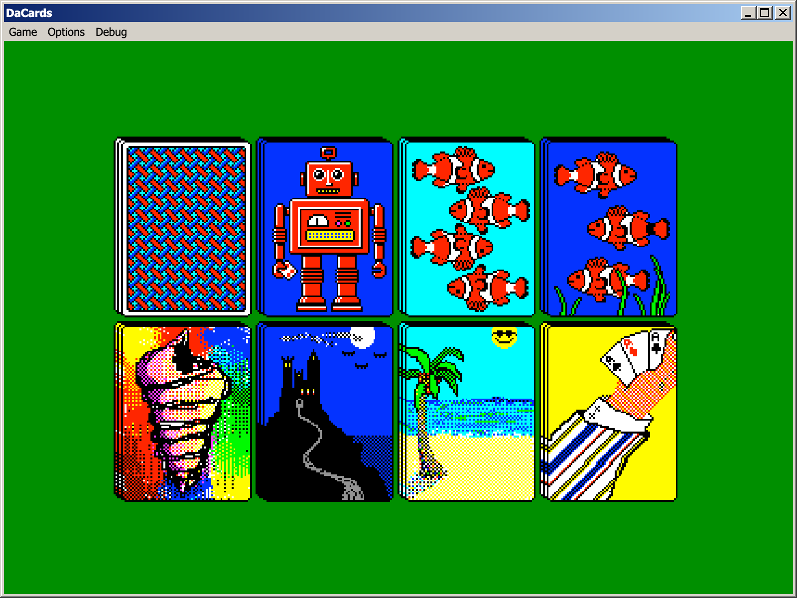

# DaCards

DaCards is a small .NET Library for handling the game logic of various card games, written to be portable for different UI frameworks. The current games implemented are:

- Solitare
- Spider Solitare
- FreeCell

## DaCardsAv

DaCardsAv is a frontend for DaCards, written with Avalonia. It is designed to look like the classic Microsoft Windows versions of their card games. 

I was inspired to write it after watching my Father struggle to play the Microsoft Solitaire Collection on his iPad. He just wanted to play the games, and not deal with the cloud login BS and ads. 

This uses the [Classic.Avalonia Theme](https://github.com/BAndysc/Classic.Avalonia).